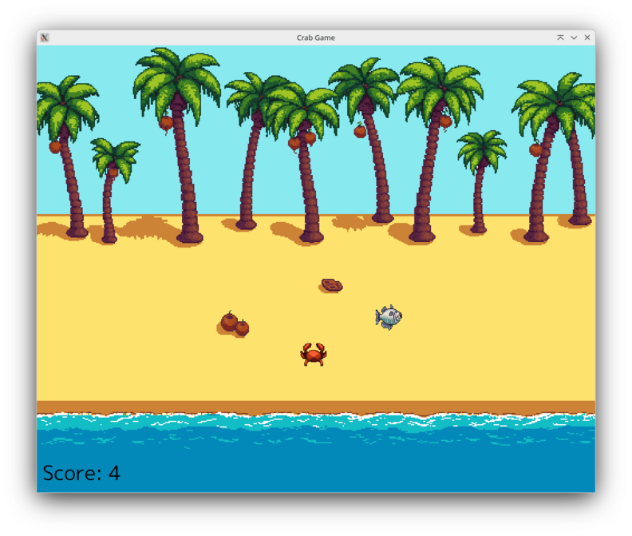
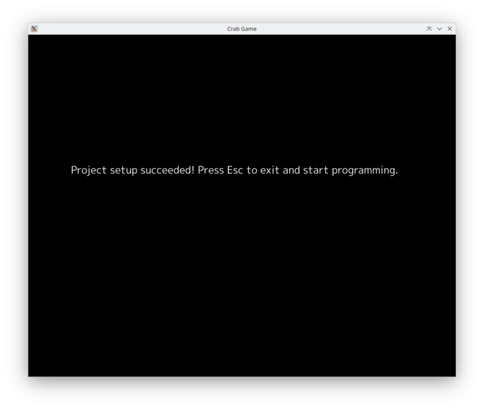
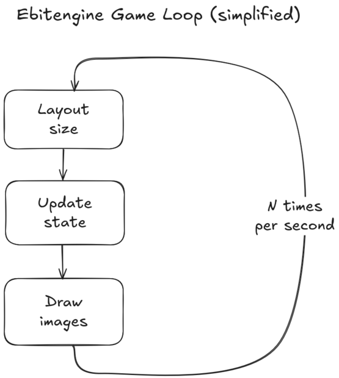
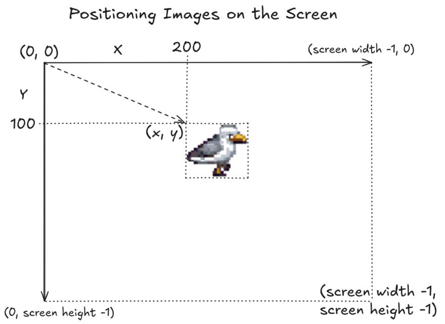
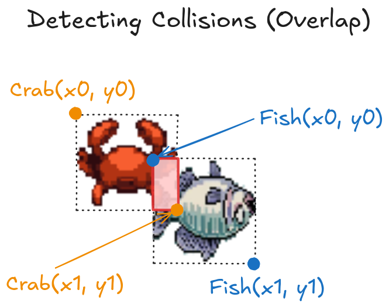
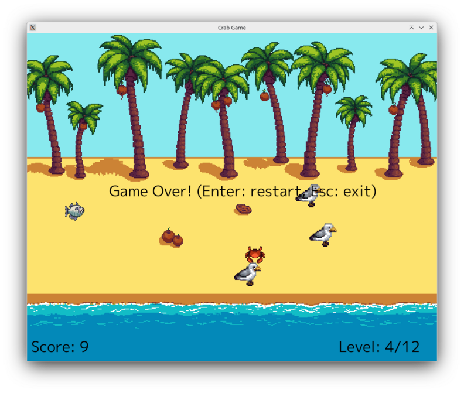

# Go Playful: Build Your First 2D Game in Go

**Bastian Isensee | DevFest Hamburg 2025**


---

# Overview

How to create a simple 2D game using Ebitengine and Go.
- Introduction to Go and Ebitengine
- Project setup
- Key concepts of 2D games and Ebitengine
- Hands-on programming

---



---

# About You

- Who has built a simple game before?
- Who has written some Go code before? 
- Who does software development for a living?

---

# About Me

- Backend Engineer (Go) & Technical Consultant (Freelance)
- Building reliable software in high-stakes domains since 12+ years (FinTechs, trading, exchanges etc.)
- Disclaimer: I never worked in the gaming industry
- But: I like to explore creative side projects for fun

---

# Go (Golang)

- A programming language originally designed at Google with systems programming in mind
- Open Source, strong community and ecosystem
- Popular for cloud-native software, e.g. Docker, Kubernetes, Terraform etc.
- Great for backends, distributed systems, infrastructure tools etc.

---

# Why use Go?

- Simple, minimalistic syntax (less clutter and complexity)
- Easy to learn, great developer experience
- Fast compilation into a single executable binary (easy deployment)
- Light on resources (cost-efficient)
- Built-in concurrency (scalable)

Most other popular languages are either more complex and error-prone, resource-heavy or slow to build or run. :thinking:

---

# Basic Go Syntax

```go
func main() {
    name := "Gopher" // Declare + init new string variable
    count := 7 // Declare + init new int variable

    for index := 0; index < count; index++ {
        if index < 4 {
            fmt.Println("Hello", name, index)
        } else {
            fmt.Println("Hello other", index)
        }
    }
}
```

---

# Result

```
Hello Gopher 0
Hello Gopher 1
Hello Gopher 2
Hello Gopher 3
Hello other 4
Hello other 5
Hello other 6
```

---

# Installing Go

- Download Go at [https://go.dev/doc/install](https://go.dev/doc/install) for your system
    - See the installation instructions for your system
    - For Mac and Windows use the installer
    - For Linux, extract the archive and extend the PATH variable
- To verify your installation, open up a terminal window and run `go version` (it should print your installed version)

---

# Project Setup

- Download the starter project from [https://github.com/isensee-bastian/crab](https://github.com/isensee-bastian/crab)
    - Click `Code` and `Download ZIP`, extract the zip file in a suitable location on your computer
    - Alternative: If you have `git` installed (optional), you can simply copy the clone URL and run `git clone <URL>`
- Open the project folder in your preferred editor
- Open a terminal window and navigate to the project folder, then run `go run main.go` to start the application

---



---

# Ebitengine (TM)

- An open source 2D game engine for Go created by Hajime Hoshi
- Provides simple, but powerful APIs for 2D graphics, reading input and playing audio
- Supports multiple platforms (desktop, mobile, web etc.)
- Matches Go's strengths and design philosophy perfectly

Thanks to the author, we can build fully functional 2D games in Go that will run on all major platforms. :pray:

---



--- 

# Ebitengine Callbacks

```go
func (g *Game) Update() error {
    // Update processes all games rules, like checking user input and keeping score.
    // All state updates must occur here, NOT in Draw.
    return nil
}

func (g *Game) Draw(screen *ebiten.Image) {
    // Draw renders all game images to the screen according to the current game state.
}

func (g *Game) Layout(width, height int) (screenWidth, screenHeight int) {
    // Layout returns the logical screen size of the game.
    // It can differ from the native outside size and will be scaled if needed.
    return width, height
}
```

---

# Starting the Game Loop

```go
func main() {
    ebiten.SetWindowSize(crab.ScreenWidth, crab.ScreenHeight)
    ebiten.SetWindowTitle("Crab Game")

    game := crab.NewGame()

    // Start the game loop. Ebitengine will run our game
    // until it is terminated or until an error occurs.
    if err := ebiten.RunGame(game); err != nil {
        log.Fatalf("Error while running game loop: %v", err)
    }
}
```

---



---

# Drawing Images

```go
type Game struct {
    birdImage *ebiten.Image
}

// Before Draw callback: Load image into memory once during game startup.
func NewGame() *Game {
    return &Game{birdImage: readImage(sprites.Beach)}
}

// In Draw callback: Render image at its current position.
func (g *Game) Draw(screen *ebiten.Image) {
    opts := &ebiten.DrawImageOptions{}
    opts.GeoM.Translate(200, 100) // x = 200, y = 100
    screen.DrawImage(g.birdImage, opts)
}
```

---

# Adding Game State

```go
type Game struct {
    crabImage *ebiten.Image
    crabX     int // The crabs current horizontal position.
    crabY     int // The crabs current vertical position.
    score     int // The number of collected fishes.
}

func (g *Game) Draw(screen *ebiten.Image) {
    // Draw crab image at its current position read from the game state.
    opts := &ebiten.DrawImageOptions{}
    opts.GeoM.Translate(float64(g.crabX), float64(g.crabY))
    screen.DrawImage(g.crabImage, opts)
}
```

---

# Reacting to Input

```go
func (g *Game) Update() error {
    if inpututil.IsKeyJustPressed(ebiten.KeyEscape) {
        return ebiten.Termination // Terminate normally.
    }

    // Move crab according to pressed arrow keys. KeyPressDuration 
    // returns the number of ticks that passed since the user 
    // started pressing the key. IsKeyJustPressed from above would not
    // work for us since we want to keep moving until the key is released.
    if inpututil.KeyPressDuration(ebiten.KeyArrowLeft) > 0 {
        g.crabX -= 1
    }
    if inpututil.KeyPressDuration(ebiten.KeyArrowRight) > 0 {
        g.crabX += 1
    }
    // ...
    return nil
}
```

---



---

# Detecting Collisions

```go
func (g *Game) Update() error {
    // ...

    // Check for collision of crab and fish by comparing their rectangular areas.
    crabArea := image.Rect(g.crabX, g.crabY, g.crabX+spriteWidth-1, g.crabY+spriteHeight-1)
    fishArea := image.Rect(g.fishX, g.fishY, g.fishX+spriteWidth-1, g.fishY+spriteHeight-1)

    if crabArea.Overlaps(fishArea) {
        // There is some overlap between the crab image the fish image.
        // That means, we collected the fish and therefore can increase the score
        // and  spawn a new fish somewhere else (using the same image).
        g.fishX += 100
        g.score += 1
    }

    return nil
}
```

---


---

# Simple Animations

```go
    func (g *Game) Update() error {
        if inpututil.IsKeyJustPressed(ebiten.KeyEscape) {
            return ebiten.Termination
        }

        // Track ticks in second to determine which crab image to 
        // show to achieve an animation effect. We want to show 
        // each crab image of the animation for an equal
        // portion of time in a single second (per TPS).
        maxTicksPerSecond := ebiten.TPS()
        maxTicksPerFrame := maxTicksPerSecond / len(g.crabImages)
        g.tickInSecond = (g.tickInSecond + 1) % maxTicksPerSecond
        g.crabImageIndex = g.tickInSecond / maxTicksPerFrame

        // ...
        return nil
    }
```

---

# Outlook

- It's easy to imagine how we could extend the game further:
    - Add birds strolling around that the crab needs to dodge
    - Add a game over condition, e.g. when our crab is caught by a bird
    - Increase difficulty by adding more birds or increasing their speed
    - Add sound effects, e.g. for collecting fish or getting caught by a bird
- You can find this extended version at [https://github.com/isensee-bastian/crab-complete](https://github.com/isensee-bastian/crab-complete)

---



---

# Thank You for Participating!

Feel free to connect with me online or in person.
- https://linkedin.com/in/bastian-isensee/
- https://www.youtube.com/@bastisprogrammingcorner
- https://bastian-isensee.com/

---


# Tools and Sources

Tools used:
- [Go](https://go.dev/) as the general programming language.
- [Ebitengine](https://ebitengine.org/) for building a 2D game.
- [GIMP](https://www.gimp.org) for adapting images from source pictures.
- [ffmpeg](https://ffmpeg.org/) for adapting audio properties like sample size and volume.
- [Marp](https://marp.app/) for creating slides to document and present gained knowledge.

All source images are AI generated using the following sites:
- [Retro Diffusion](https://www.retrodiffusion.ai/) for generating pixel art images, especially animations.
- [ideogram](https://ideogram.ai) for general image generation, including some pixel art images.
